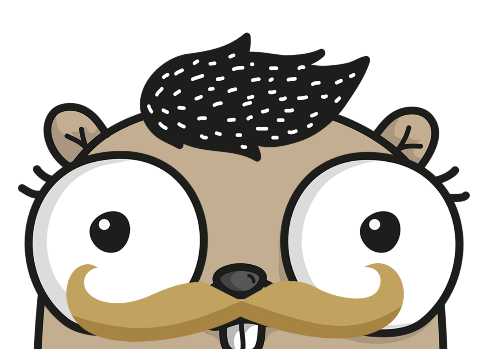

# Gopherize.me



* Code for [Gopherize.me](https://gopherize.me)

## Artwork

The artwork is stored in the default Google Cloud Storage account for the app.

Inside the `artwork` folder, each folder represents a category of items from which 
users may select one feature. A feature is a PNG image that is overlaid in category order to
build up the final image.

An example artwork structure might look like this:

```
artwork/
	000-Category1/
		Feature1.png
		Feature2.png
		Feature3.png
	010-Category2/
		Feature1.png
		Feature2.png
		Feature3.png
	020-Category3/
		Feature1.png
		Feature2.png
		Feature3.png
```

### Rules

* Filenames are important, as case is preserved
* Underscores become spaces (so `Pirate_Beard.png` will become `Pirate Beard` in the UI)
* Numbers (e.g. `010-`) are stripped from category names, but used to preserve ordering
* All images must be PNG format
* All images must be the same size
* Images must be publicly accessible (setting in Google Cloud Storage)
